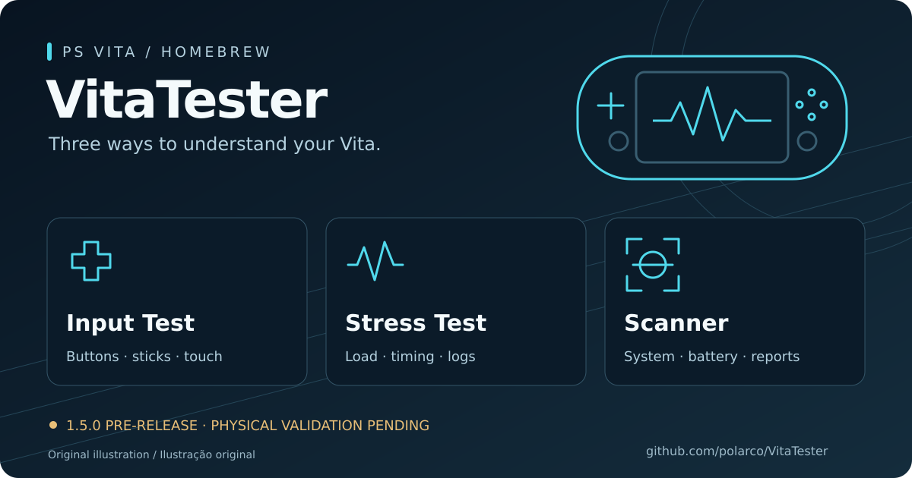

# VitaTester

Veja suas entradas. Observe o comportamento sob carga. Explore o hardware do Vita.
Três módulos independentes de diagnóstico para PS Vita, baseados no VitaTester de SMOKE.

[English](README.md) · **Português brasileiro**

[](https://github.com/polarco/VitaTester/releases/tag/v1.5.0)
[](https://github.com/polarco/VitaTester/actions/workflows/build.yml)
[](LICENSE)

## Download

> **Candidato de correção: 1.5.2.** A 1.5.1 já abre o menu no Vita físico,
> mas timestamps do histórico inicial bloquearam os toques. Este código corrige
> a captura; o novo teste de toque está pendente. Os downloads publicados da 1.5.0
> abaixo permanecem intactos. Veja a [triagem](docs/STARTUP.md).

**[Baixar VitaTester 1.5.0 (.vpk)](https://github.com/polarco/VitaTester/releases/download/v1.5.0/VitaTester-1.5.0.vpk)** ·
[Arquivo SHA-256](https://github.com/polarco/VitaTester/releases/download/v1.5.0/VitaTester-1.5.0.vpk.sha256) ·
[Notas da release](https://github.com/polarco/VitaTester/releases/tag/v1.5.0)

> **Pré-release — validação em Vita físico pendente.** Testes automatizados e
> build VitaSDK aprovados. Os resultados são evidências de diagnóstico, sem certificar a condição do hardware.

<details>
<summary>Verificar o download (SHA-256)</summary>

Baixe o VPK e o arquivo de checksum para a mesma pasta e execute:

```sh
sha256sum -c VitaTester-1.5.0.vpk.sha256
```

SHA-256 esperado para o VPK de 897.663 bytes:

```text
c9e813447211bd9e52353376419d280ddf8bc973cb977ad42f5f9c90e7a51da0
```

</details>

## Três módulos, um aplicativo

| Módulo | O que permite fazer |
|---|---|
| **Input Test** | Observar botões, os dois analógicos e multitoque frontal/traseiro no desenho original, sem HUD de stress. |
| **Stress Test** | Iniciar carga opcional de CPU, comparar tempos de captura e progresso dos workers, usar diagnóstico livre/guiado e salvar log persistente. |
| **Scanner** | Consultar evidências passivas de sistema/bateria/armazenamento; executar etapas de sensores, alto-falantes, microfone, câmeras, Wi-Fi e leitura limitada de arquivo; salvar relatórios parciais ou concluídos. |

O aplicativo abre com stress **desligado**. O Scanner coleta inventário passivo
na entrada; etapas ativas exigem comando por toque. Scanner e carga de stress
nunca executam juntos. O banner é uma ilustração original, não uma captura do aplicativo.

## Instalação rápida

1. Use um Vita que já execute homebrew e baixe o VPK acima.
2. Transfira-o para o console e instale com VitaShell.
3. Abra **VitaTester** e toque no cartão de um módulo.

Title ID: `VITATESTR` · SFO: `01.50`. A instalação substitui uma bolha existente
do VitaTester; faça backup dos relatórios/logs que desejar preservar. Não exige
plugin kernel. Os comandos do aplicativo estão em português; a documentação está nos dois idiomas.

## Controles

| Ação | Controle |
|---|---|
| Escolher módulo | Toque no cartão do menu. |
| Voltar ao menu | Mantenha exatamente **três dedos no centro da tela frontal por 2 segundos**; solte todos antes de repetir. |
| Iniciar/parar stress | Toque em **Iniciar / Parar stress**. |
| Executar etapa do Scanner | Em **Testes**, escolha uma etapa e toque em **Iniciar**, **Parar** ou **Repetir**. Confirme **PASSOU / FALHOU / PULADO**. |
| Voltar à LiveArea / fechar | Pressione **PS** / encerre a bolha na LiveArea. |

Start e Select continuam como entradas de diagnóstico. O gesto aguarda a limpeza
do stress e a restauração dos clocks. PS/eventos do sistema cancelam a carga e
etapas ativas do Scanner; retornar nunca as reinicia automaticamente. Veja o
[guia de uso](docs/USAGE.pt-BR.md) para área do gesto, limites, relatórios e recuperação de erros.

## Estado de validação

| Evidência | Estado |
|---|---|
| Simulações host do código de produção, ASan/UBSan | Aprovados para 1.5.0 |
| Build VitaSDK fixado, identidade/assets do VPK | Aprovados — [CI da release](https://github.com/polarco/VitaTester/actions/runs/34237819400) |
| Entradas físicas, tempos, dispositivos, armazenamento e comportamento térmico | **Pendentes nos três módulos** |

Siga o [procedimento de validação física](docs/VALIDATION.md) antes de stress
prolongado. Consultas indisponíveis ou negadas são inconclusivas e não comprovam
defeito. As leituras de bateria descrevem a bateria, não a temperatura do processador.

## Documentação e comunidade

- [Guia de uso e compilação](docs/USAGE.pt-BR.md) · [Perguntas frequentes](docs/FAQ.pt-BR.md)
- [Arquitetura e limites do Scanner (inglês)](docs/SCANNER.md) · [Formato do log (inglês)](docs/LOG.md)
- [Validação física (inglês)](docs/VALIDATION.md) · [Changelog (inglês)](CHANGELOG.md)
- [Como contribuir](CONTRIBUTING.md) · [Relatar bug, sugerir melhoria ou enviar resultados físicos](https://github.com/polarco/VitaTester/issues/new/choose)

## Créditos e licença

[MIT](LICENSE) · **Copyright (c) 2015 SMOKE**, preservado integralmente.
Baseado em [NamelessGhoul0/VitaTester](https://github.com/NamelessGhoul0/VitaTester),
com o histórico de **SMOKE, Carlanga e NamelessGhoul0** preservado.
Agradecimentos a d3m3vilurr e coderobe (multitoque), xerpi (vita2dlib),
UrielTapia97 (imagens/ícones originais) e Ruben_Wolfe451 (ajuda matemática).
Trabalho do fork nas versões 1.4.0–1.5.0 e apresentação: **Filipe Fabiani**.
